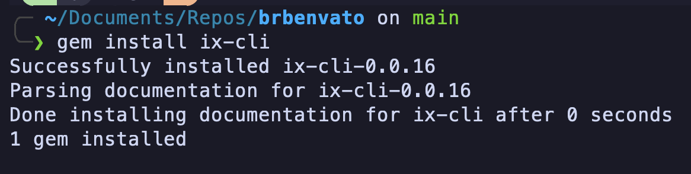
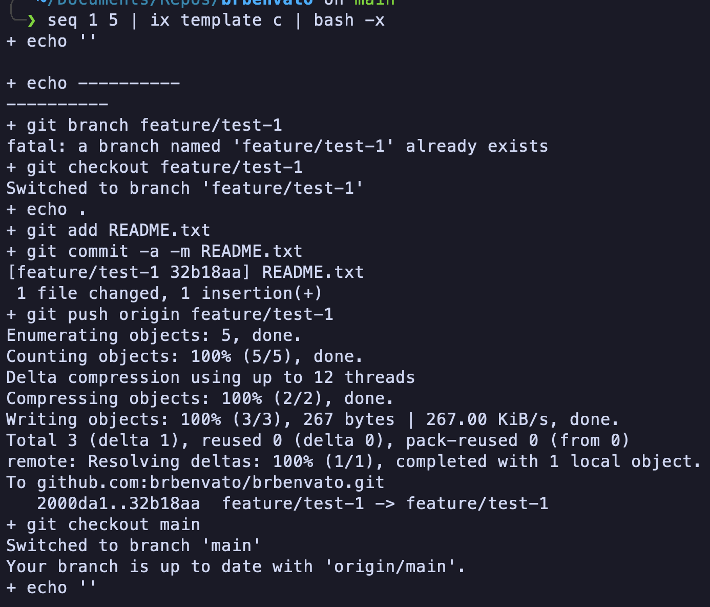

## Usage

1. Install ix-cli ruby gem

`gem install ix-cli`

2. Run the c script to create the required branches.

`seq 1 5 | ix template c | bash -x`

# Project Overview

This project involves creating multiple branches and executing workflows using GitHub Actions. However, due to race conditions that occur when multiple developers push their changes simultaneously, only a subset of the workflows are executed.

## File Structure

- **c**: This is a small script responsible for creating the branches. It triggers the execution of the create.yaml workflow.
- **create.yaml**: This workflow file is triggered by c script. It, in turn, executes another small script developed to address race condition issues.

## Race Condition Solution

To mitigate the race condition problem that arises when multiple developers push their changes concurrently, a custom script has been developed. This script is executed by the create.yaml workflow and implements a solution to ensure that all necessary workflows are executed correctly.

